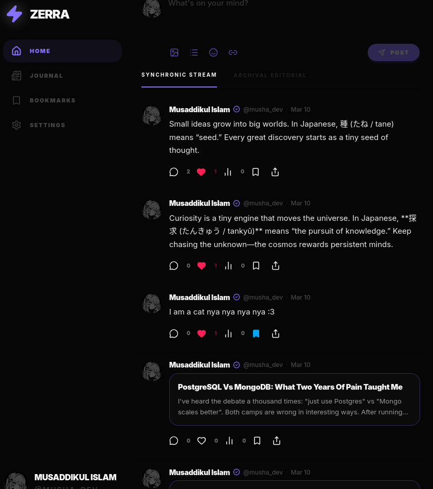
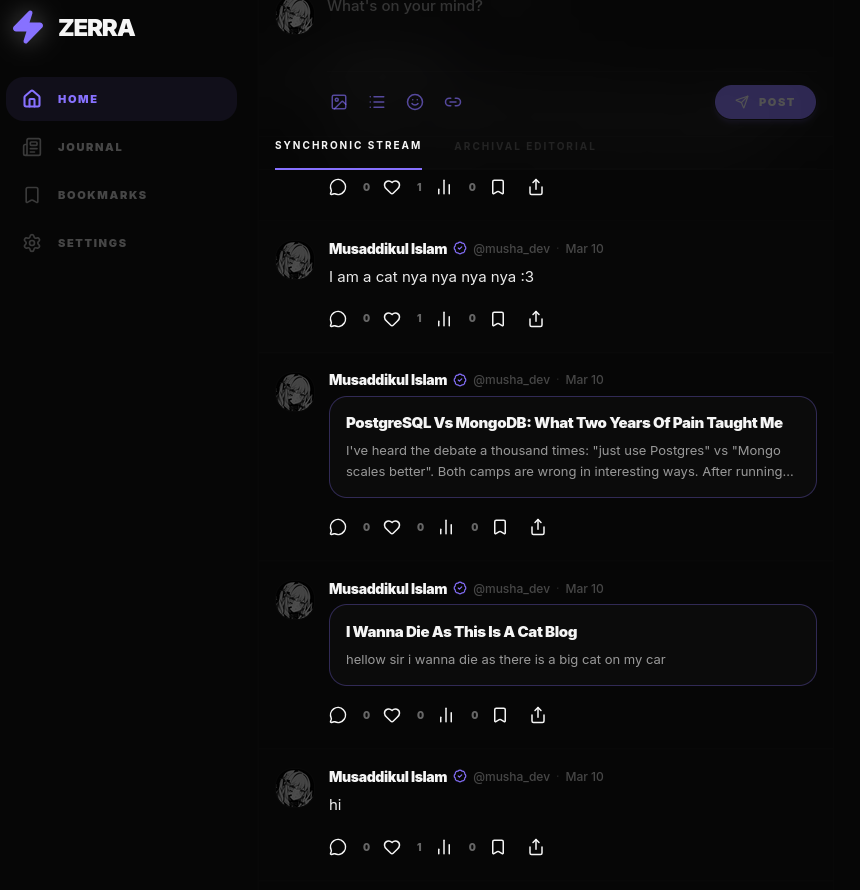

<h1 align="center">Zerra — Frontend</h1>

<p align="center">
  A high-performance, dark-first social architecture built with <strong>Next.js 15</strong>, <strong>TypeScript</strong>, and <strong>Tailwind CSS v4</strong>.
  Consolidating micro-posts, long-form editorial content, and archival bookmarking into a single, cohesive feed.
</p>

<p align="center">
  
  
  
  
</p>

---

## Screenshots

<div align="center">

|                                                 |                                                 |
| :---------------------------------------------: | :---------------------------------------------: |
|                  **Main Feed**                  |                **User Profile**                 |
|  |  |
|            **Profile Content Tabs**             |                **Mixed Stream**                 |
|  |  |

</div>

---

## Technical Features

### Feed Management

- **Dual-stream architecture**: Seamlessly toggle between Synchronic Stream (micro-posts) and Archival Editorial (articles).
- **Intelligent Header**: Adaptive sticky composer that responds to scroll velocity for maximum screen real estate.
- **Dynamic Composer**: Auto-scaling textarea with integrated character telemetry and validation.
- **Inline Expansion**: Efficient content truncation with zero-layout-shift expansion for long-form posts.
- **Optimistic State**: Instantaneous UI updates for interactions utilizing client-side state prediction.

### Profile Protocol

- **Condensed Snap-Header**: Intersection-observed sticky bar that activates upon banner displacement.
- **Visual Identity**: Full-bleed media banners with integrated alpha-mask gradients for depth.
- **Real-time Metrics**: Dynamic follower/following synchronization with the core API.
- **Data Partitioning**: Tabbed content organization with integrated item-count telemetry.

### Editorial Journal

- Narrative-focused detail view with predictive read-time calculation.
- Media-rich archival presentation with dedicated author modules.
- Integrated response cycles and social interaction hooks.

### Configuration System

- **Appearance Protocol**: Real-time theme injection supporting 6 distinct oklch-based color schemes.
- **Persistence Logic**: Local-storage synchronization with blocking pre-hydration scripts to eliminate flickering.
- **Unified Settings**: Centralized interface for identity management and security parameters.

---

## Design Specifications

| Token            | Value                         |
| ---------------- | ----------------------------- |
| Core Typography  | Inter (Sans) / JetBrains Mono |
| Surface Geometry | 2xl / 3xl curvilinear radii   |
| Animation Logic  | CSS-driven entry transitions  |
| Interface Chrome | 4px minimized scrollbars      |

**Color System** (OKLCH-native palettes):

| Schema  | Identity               |
| ------- | ---------------------- |
| Mono    | Balanced Neutrals      |
| Violet  | High-contrast Purple   |
| Rose    | Warm Spectrum Red      |
| Sky     | Cool Spectrum Blue     |
| Emerald | Natural Spectrum Green |
| Amber   | High-visibility Gold   |

---

## Project Architecture

```
src/
├── app/                    # Routing layer and layouts
├── components/
│   ├── composer/           # Publication interfaces
│   ├── feed/               # Stream rendering logic
│   ├── layout/             # Shell and navigation
│   ├── profile/            # Identity modules
│   ├── settings/           # Configuration protocols
│   └── shared/             # Atomic UI components
├── contexts/               # Global state providers
├── hooks/                  # Reactive logic and data fetching
├── lib/                    # Core utilities and API clients
└── types/                  # Typed contract definitions
```

---

## Deployment and Setup

```bash
# Initialize dependencies
pnpm install

# Execute development environment
pnpm dev
```

The frontend operates as a consumer of the Zerra API. Proxying configuration is handled via `next.config.ts`, mapping `/api/*` requests to the core service layer.

---

## Data Integration Layer

Utilizes a centralized `fetchApi()` provider with the following capabilities:

- Automated credential injection.
- Silent 401 interceptors for background JWT refresh-token rotation.
- Recursive request retries upon successful identity renewal.

---

## Responsive Adaptation

- **Wide Aspect**: Triple-column focused layout with prioritized center-gutter.
- **Mobile Aspect**: Bottom-docked primary navigation with safe-area compensation.
- Universal layout responsiveness via adaptive Tailwind v4 utility constraints.
